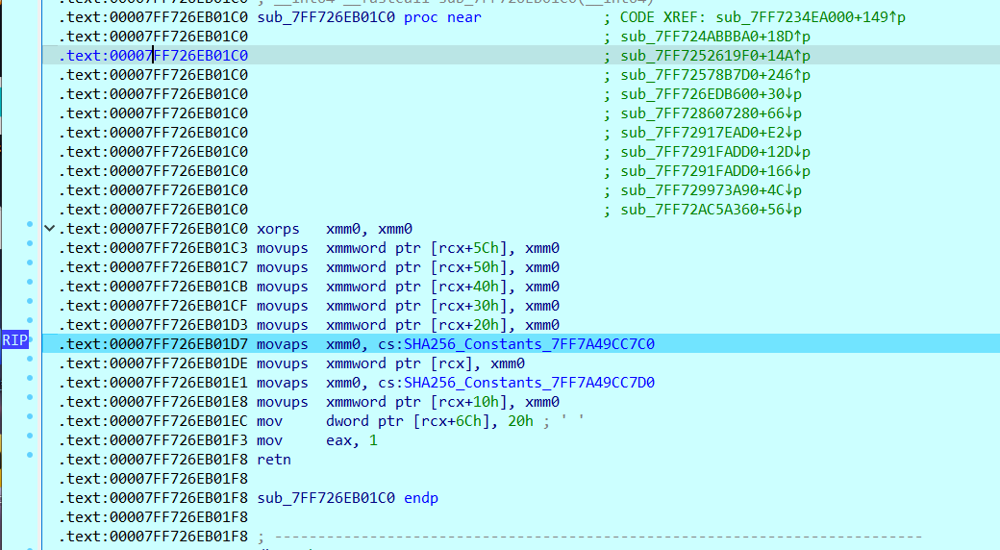
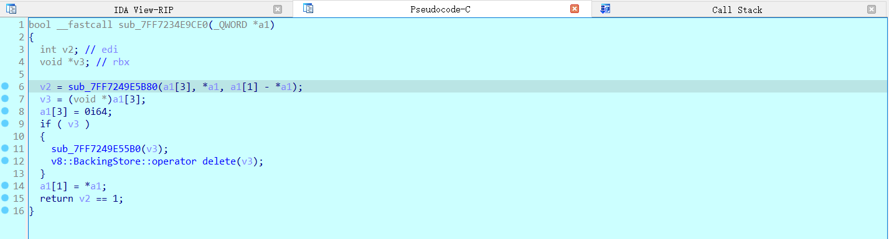
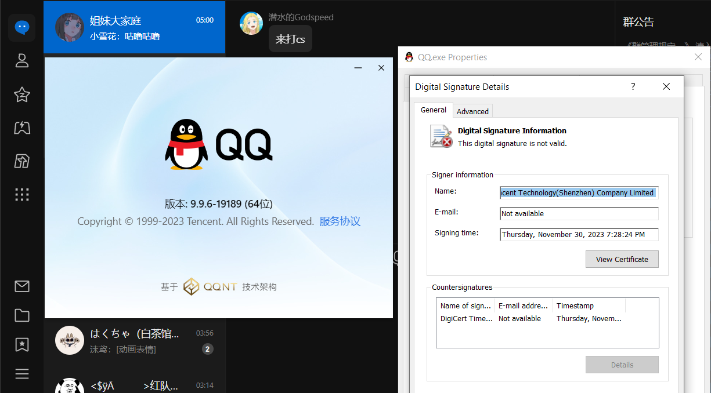

# QQNTFileVerifyPatch
逆他妈的QQNT Patch文件检测  
PatchedRelease内有已经去除验证的文件下载  
特别说明,LiteLoaderQQNT还没有适配最新版本,请详细阅读原Repo MD,别等下升高版本了降回去收不到讯息了  

# Patcher
适用版本应该是9.9.2-16183以上都可以用,实测9.9.6-19189，9.9.6-19527可以修补  
另外一个Patcher(现已支持9.9.2-16183以上版本修补): https://github.com/xh321/LiteLoaderQQNT-PatcherNFixer  
1/22/2024补 根据[issue #1](https://github.com/LiteLoaderQQNT/QQNTFileVerifyPatch/issues/1) 测试,本Patcher在9.9.2-16183版本也适用  
前往Release下载以ADMIN身份运行,选中QQ文件会自动创建备份文件与修补,显示Patched!即为成功  
源码在Repo有 

# how2patch
你需要有FindCrypt插件,IDA 7.7(我的7.7不知道为什么Patch没有应用到输入文件选项,后面我换成8.3了)  
讲的不是很详细,有些加密解密的东东是凭经验看的没有细讲  
1.睡觉前载入QQ.exe到IDA,分析时间非常的长,并且会生成一个超级无敌大的IDA64数据库  
2.等待分析完毕后,使用插件FindCrypt 寻找SHA256散列值(偶然用命令行运行QQ看到的输出才知道是SHA256),按住Ctrl+Alt+F使用插件
3.等待插件查找完毕,在查找出来的.rdata散列值下断点  
  
4.调试,第一个断到使用散列值的应该是一个有关数字签名的东东应该是校验签名用的(但是貌似不管有没有效)  
  
第二个断到的地方是上一个函数会用到的奇奇妙妙の东西忽略即可x  
  
第三个断到的地方就是第四个断点用到的东西,直接看第四个断点的伪代码即可,根据肉身实验,当Package.json被修改后v61会返回0,原版就会返回1,详细看到函数上面的 if ( (_DWORD)Size && memcmp(Buf1, Buf2a, Size) )  
若这个函数返回0 WinMain里面就不会加载GUI什么的,会return指然后喜提文件损坏的提示  
  
5.看Call Stack找简洁方便的地方动手术,隔三层的地方就刚好  

  
将call xxxx改成mov eax,1 刚刚好字节对得上,然后写出文件即可  
  
经测试可以正常使用 (LiteLoaderQQNT什么时候适配 (发出300分贝的猫叫  

# 免责声明
仅供学习,切勿用于违法用途  
别看你今天闹得欢,小心啊今后拉清单

